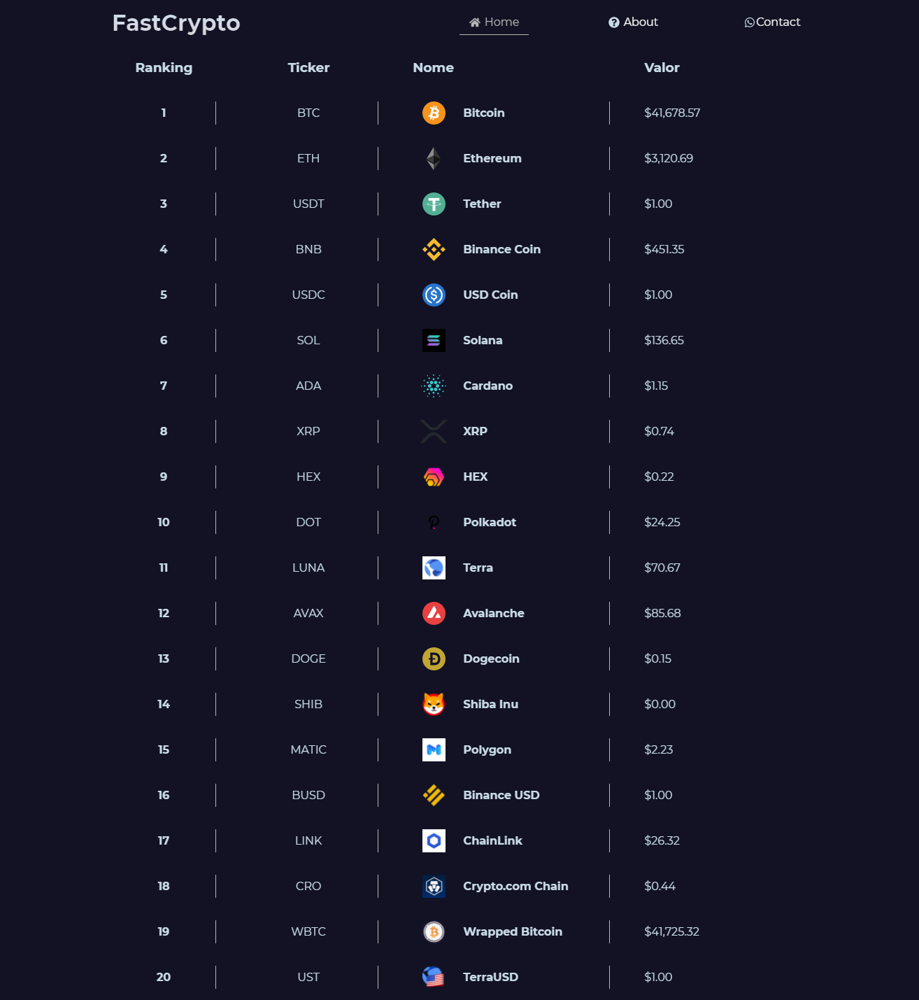

# FastCrypto

Site para mostrar as cotações das principais criptomoedas do mercado.

Nessa primeira versão estou listando apenas as 20 maiores moedas.

Este projeto está sendo desenvolvido para fins de estudos e não tem fins lucrativos.

<a href="https://fastcrypto.vercel.app"> <h3>Acesse o projeto na web</h3></a>

### Como executar o projeto:

- Primeiro clone o repositório:

  ```
  git clone https://github.com/matheusalecksander/fastcrypto-web.git
  ```

- Após clonar, instale as dependências do projeto utilizando o comando yarn dentro da pasta raiz do projeto:

  ```
  yarn
  ```

- Para que o projeto execute de forma correta você precisará de uma api key da nomics, garanta a sua acessando:

  ```
  https://p.nomics.com/cryptocurrency-bitcoin-api
  ```

- Crie na raiz do projeto um arquivo chamado .env.local e salve a sua chave da api lá:

  ```
  API_KEY="SUA_CHAVE_AQUI"
  ```

- Pronto, agora é só executar o projeto e fazer suas próprias alterações:
  ```
  yarn dev
  ```

#### Mudanças que irei implementar

- Campo de busca;
- Página de detalhes com mais informações;
- Listar mais criptomoeadas, utilizando paginação;

###### Sinta-se a vontade para contribuir ou sugerir novas funcionalidades

###### Meus Contatos

- Linkedin : https://linkedin.com/in/matheus-alecksander
- Email: matheusalecksander@gmail.com


